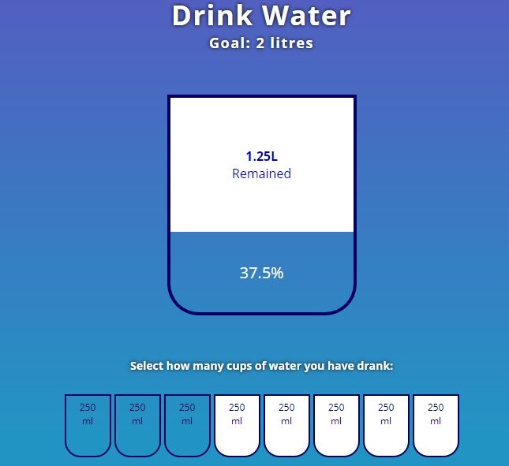

# FillUpTheCupApp

## Demo

[**click live demo of the project**](https://dominiksiejka.github.io/FillUpTheCupApp)



## Table of Contents

- [About the Project](#description)
- [How to use](#how-to-use)
- [Technologies used](#built-with)
- [Setup steps](#setup)
- [Sources](#sources)
- [License](#license)

## Description

FillUpTheCupApp shows the manipulation of a DOM using javascript. You need to select the right amount then the cup will show the animation with some simple calculations with the left space.

## How to use

Simply just click by how much you would like to fillup that cup. Then the animation will run and the space left to fill.

## Built with

- HTML5
- CSS
- Vanilla JavaScript

## Setup

```
with BASH

# clone the remote repo to your local one
$ git clone https://github.com/dominiksiejka/FillUpTheCupApp.git

# open the index.html file or use your code editor to open it with live server

```

## Sources

- Icons from [Font Awesome ](https://fontawesome.com)
- Font from [Google Fonts ](https://fonts.google.com/)

## License

- MIT © [Dominik Siejka ](https://github.com/dominiksiejka/FillUpTheCupApp)
